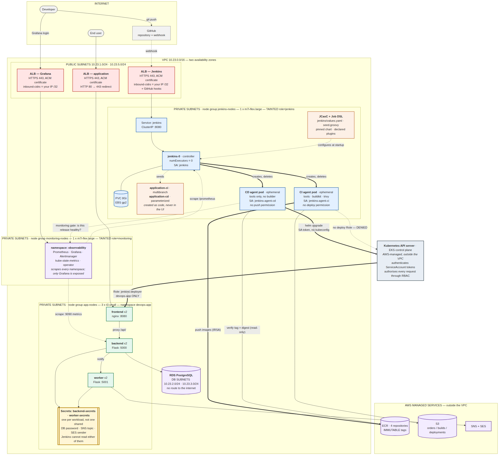
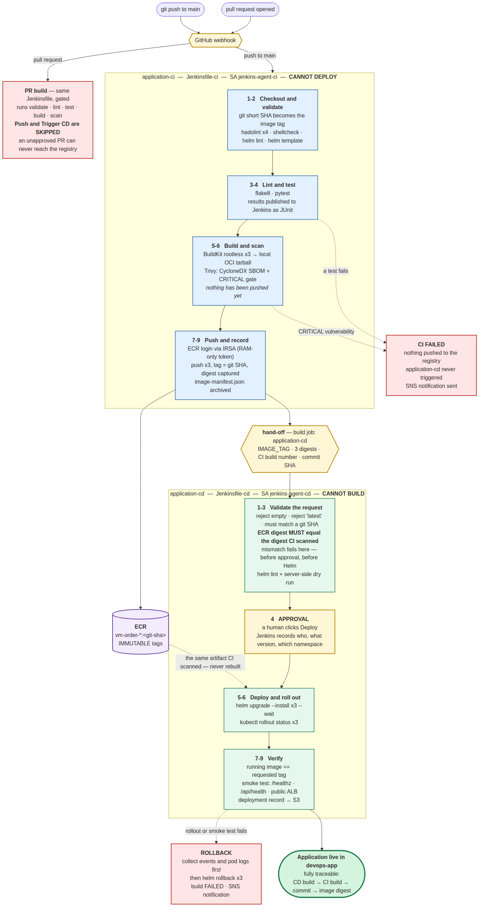
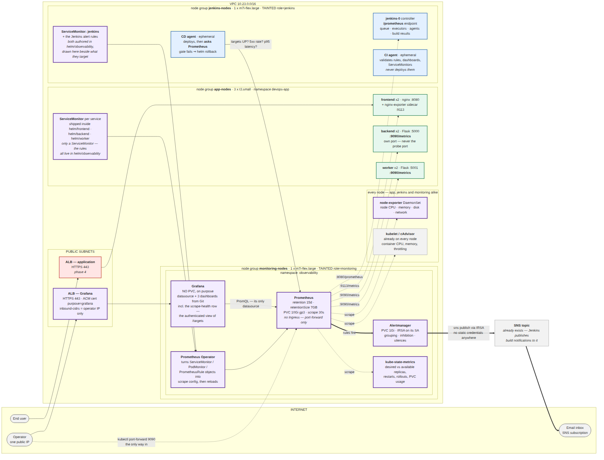
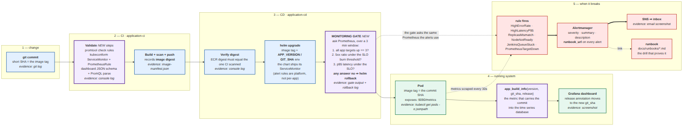

# VM Order Portal — CI/CD and observability inside Kubernetes

A multi-service application built, scanned and deployed by **two separate
Jenkins pipelines** running inside the same EKS cluster the application runs
in, and **monitored by a Prometheus stack that can roll a release back**.

Everything is installed from code — Jenkins plugins, jobs and agent templates;
Prometheus rules, Grafana dashboards and datasources. Nothing is configured by
hand in a UI, and Grafana runs with no database precisely so that a dashboard
edited in the browser cannot survive a restart.

Destroy the cluster, run `./scripts/deploy.sh`, and everything comes back
identically.

**What the monitoring actually does:** after CD deploys, it asks Prometheus
whether the release is serving — are all targets up, are the pods reporting
*this* commit, is the error ratio inside the SLO, is p95 inside the SLO. A
release that cannot answer yes to all four is rolled back automatically.

---

## Table of contents

1. [Architecture](#1-architecture)
2. [Prerequisites](#2-prerequisites)
3. [Quick start](#3-quick-start)
4. [Installing Jenkins from code](#4-installing-jenkins-from-code)
5. [The two jobs](#5-the-two-jobs)
6. [CI pipeline](#6-ci-pipeline)
7. [CD pipeline](#7-cd-pipeline)
8. [Rollback](#8-rollback)
9. [Credentials and secrets](#9-credentials-and-secrets)
10. [Security](#10-security)
    - [10.9 Recurring maintenance](#109-recurring-maintenance) — base image digests, dependency refresh
11. [Cleanup](#11-cleanup)
12. [Trade-offs and decisions](#12-trade-offs-and-decisions)
13. [Testing](#13-testing)
14. [Observability](#14-observability) — metrics, dashboards, alerts, the CD gate


---

## 1. Architecture

**Environment: AWS EKS.** Jenkins runs in the same cluster as the application
but in a separate namespace, on a separate, tainted node group. Running it in
the same cluster keeps the project inside one VPC and one IAM boundary, and
lets CD authenticate to the Kubernetes API with a ServiceAccount token rather
than a stored kubeconfig — there is no cluster credential to leak. The security
boundary between Jenkins and the application is enforced by namespaces, RBAC,
NetworkPolicies and separate IAM roles rather than by a cluster boundary; §10
sets out exactly what each identity can and cannot do.

### Deployment view



<details><summary>Mermaid source (docs/architecture-deployment.mmd)</summary>

See [`docs/architecture-deployment.mmd`](docs/architecture-deployment.mmd).
</details>

### Pipeline flow



<details><summary>Mermaid source (docs/architecture-pipeline.mmd)</summary>

See [`docs/architecture-pipeline.mmd`](docs/architecture-pipeline.mmd).
</details>

### Layers and ownership

| Layer | Created by | Contains | Lifecycle |
|---|---|---|---|
| Infrastructure | Terraform | VPC, EKS (2 node groups), RDS, S3, SNS, ECR, IAM/IRSA | per cycle |
| Platform | `install-jenkins.sh` | ALB controller, EBS CSI, metrics-server, namespaces, app Secret, RBAC, NetworkPolicies, Jenkins | per cycle |
| Application | **Jenkins CD pipeline** | frontend, backend, worker | many times per cycle |

Terraform never creates Kubernetes application objects, and Jenkins never
creates AWS infrastructure.

### Namespaces

| Namespace | Contents |
|---|---|
| `jenkins` | controller Pod, ephemeral agent Pods |
| `devops-app` | frontend ×2, backend ×2, worker ×2 |
| `kube-system` | ALB controller, EBS CSI driver, metrics-server |

Nothing runs in `default` — `verify-jenkins.sh` asserts this.

---

## 2. Prerequisites

| Tool | Version | Notes |
|---|---|---|
| AWS CLI | v2 | `aws sts get-caller-identity` must work |
| Terraform | ≥ 1.5 | tested on 1.15 |
| kubectl | 1.34–1.36 | must be within ±1 minor of the cluster (1.35) |
| Helm | 3.15+ or 4.x | both work; the project uses no Helm-4-breaking features |
| Docker | any recent | needed once, to build the agent image |
| jq | any | used by the webhook script |

Also required:

- **A verified SES sender address** — the worker cannot send mail without it.
  `aws ses verify-email-identity --email-address you@example.com --region us-east-1`
- **A GitHub token** with `admin:repo_hook` scope, for webhook registration.
  Optional: without it CI falls back to a 5-minute SCM poll.

---

## 3. Quick start

```bash
git clone <your-fork> && cd VMOrderPortal_Phase4

cp terraform/terraform.tfvars.example terraform/terraform.tfvars
curl -s https://checkip.amazonaws.com        # your public IP, for the next step
$EDITOR terraform/terraform.tfvars           # 6 values

export GITHUB_TOKEN=ghp_xxxxxxxx             # optional but recommended

./scripts/deploy.sh                          # ~30 minutes
```

### The six values in `terraform.tfvars`

| Variable | Notes |
|---|---|
| `db_password` | RDS master password. Rejects `/`, `@`, `"` and spaces. Never committed — the file is gitignored |
| `s3_bucket_name` | Must be globally unique across all of AWS, and lowercase. Add a random suffix |
| `notification_email` | Where SNS order alerts and Jenkins build notifications go |
| `ses_sender` | The SES address you verified in §2 |
| `github_repo_url` | Your fork's HTTPS clone URL. Jenkins clones from here and the webhook is registered against it |
| `api_public_access_cidrs` | Who may reach the Kubernetes API from the internet. See §10.1 — **list two addresses, not one** |

`terraform.tfvars` is the single source of truth: every script reads these
values back through `terraform output`, so nothing is duplicated or hard-coded.

`deploy.sh` runs, in order: `terraform apply` → **`install-observability.sh`**
→ `install-jenkins.sh` → `create-jobs.sh` → `register-webhook.sh` →
`verify-jenkins.sh` → `verify-observability.sh`. It prints the Grafana URL and
password after step 2 and the Jenkins URL, username and password at the end.

Observability is installed **before** Jenkins, and that ordering is load
bearing: the application and Jenkins charts ship `ServiceMonitor` objects, and
a chart that references a custom resource whose CRD does not exist yet fails
outright.

Then push a commit, or open Jenkins and run `application-ci` manually.

---

## 4. Installing Jenkins from code

Four scripts, each independently runnable and idempotent.

| Command | What it does |
|---|---|
| `./scripts/install-jenkins.sh` | Add-ons, namespaces, app Secret, RBAC, ServiceAccounts, NetworkPolicies, TLS certificate, agent image, Jenkins |
| `./scripts/configure-jenkins.sh` | Regenerates the JCasC config and applies it. Run this after your IP changes |
| `./scripts/create-jobs.sh` | Creates both jobs from `jenkins/jobs/seed.groovy` |
| `./scripts/verify-jenkins.sh` | ~35 assertions that the install matches the design |
| `./scripts/uninstall-jenkins.sh` | Removes Jenkins, its PVC and its ALB. The application is untouched |

Supporting scripts: `create-cert.sh` (self-signed certificate → ACM),
`register-webhook.sh` (GitHub webhook, re-registered each cycle).

**What is defined as code**

| Concern | File |
|---|---|
| Jenkins version | `jenkins/values.yaml` → `controller.image.tag` (pinned, never `latest`) |
| Chart version | `jenkins/CHART_VERSION` (pinned) |
| Plugins | `jenkins/values.yaml` → `installPlugins` |
| System config, agents cloud | `jenkins/values.yaml` → JCasC + chart values |
| Environment values | generated by `configure-jenkins.sh` from Terraform outputs |
| Jobs | `jenkins/jobs/seed.groovy` (Job DSL) |
| RBAC, ServiceAccounts | `jenkins/rbac.yaml` |
| Network isolation | `jenkins/networkpolicy.yaml` |
| Agent image | `jenkins/agent-tools/Dockerfile` |

**Reproducibility check:** `uninstall-jenkins.sh` then `install-jenkins.sh` and
`create-jobs.sh` restores an identical Jenkins with both jobs present. Build
history is lost by design; build artifacts are archived to S3 before teardown.

---

## 5. The two jobs

| Job | Type | Jenkinsfile | Trigger | ServiceAccount |
|---|---|---|---|---|
| `application-ci` | Multibranch pipeline | `Jenkinsfile-ci` | GitHub webhook (push + PR); 5-min poll fallback | `jenkins-agent-ci` |
| `application-cd` | Parameterised pipeline | `Jenkinsfile-cd` | Triggered by CI, or run manually with a tag | `jenkins-agent-cd` |

Both are created from `jenkins/jobs/seed.groovy` through JCasC and the job-dsl
plugin. Creating them by hand in the UI would not satisfy the reproducibility
requirement, and is never necessary.

### How CI hands off to CD

CI archives `image-manifest.json` — tag, per-image digest, commit, branch and
CI build number — and then calls `build job: 'application-cd'` with the tag and
digests as parameters.

This gives traceability in both directions:

- From a **CD build**: the parameters name the CI build, the git commit and the
  exact image digest deployed.
- From a **CI build**: the archived manifest records precisely what was
  produced and promoted.

CD can also be run manually with a tag typed in, which is how you redeploy or
roll forward to a previously built version.

---

## 6. CI pipeline

`Jenkinsfile-ci` — **contains no deploy stage.** Its ServiceAccount has no
Kubernetes deploy permission, so even a modified Jenkinsfile could not deploy.

| # | Stage | Purpose |
|---|---|---|
| 1 | Checkout | Records commit SHA, branch and build number |
| 2 | Validate | Project structure, hadolint ×4, shellcheck, `helm lint`, `helm template` |
| 3 | Static analysis | `flake8` (config and rationale in `setup.cfg`) |
| 4 | Unit tests | `pytest` → JUnit XML published to Jenkins (52 tests) |
| 5 | Build ×3 | Rootless BuildKit → local OCI tarball. **Nothing pushed yet** |
| 6 | Scan + SBOM | Trivy: CycloneDX SBOM per image, then a CRITICAL gate |
| 7 | ECR login | IRSA-issued token, RAM-only, ~12 h |
| 8 | Push ×3 | Tag = **git short SHA**; digest recorded via `--metadata-file` |
| 9 | Metadata | `image-manifest.json` archived |
| 10 | Trigger CD | `main` only |

**Scanning happens before pushing.** The build writes a tarball, Trivy scans
it, and only then does the push stage run — a CRITICAL finding means the image
never reaches the registry at all.

**Tagging.** The tag is the git short SHA. Never `latest`; and deliberately not
`BUILD_NUMBER`, which restarts at 1 whenever Jenkins is rebuilt and would then
collide with an existing IMMUTABLE ECR tag.

**Pull requests** run stages 1–6 and stop. `ECR login`, `Push` and `Trigger CD`
are gated on `IS_PR != true`, so an unapproved PR can never reach the registry
or the cluster.

**Failure behaviour.** Any failing stage fails the build, so the push never
happens and `application-cd` is never triggered. A notification is published
to SNS, which forwards it to the subscribed address. The
workspace and the ECR token are removed in `post { always }`.

---

## 7. CD pipeline

`Jenkinsfile-cd` — **contains no build stage.** Its agent Pod has no BuildKit
container and its IAM role has no `ecr:PutImage`.

| # | Stage | Purpose |
|---|---|---|
| 1 | Validate input | Rejects empty, rejects `latest`, requires a git-SHA-shaped tag and a permitted namespace |
| 2 | Verify image identity | Read-only ECR lookup, then **compares the digest ECR serves against the digest CI scanned**. Mismatch fails the build before the approval gate |
| 3 | Manifest validation | `helm lint` + server-side dry run |
| 4 | **Approval** | Manual gate showing who, what version, which namespace *(bonus)* |
| 5 | Deploy | `helm upgrade --install` ×3 `--wait` |
| 6 | Rollout | `kubectl rollout status` ×3 |
| 7 | Verify running version | Asserts the image on each Deployment matches the requested tag |
| 8 | Smoke test | `/healthz`, `/api/health`, then the public ALB |
| 9 | Record deployment | Deployment record, cluster state and Helm releases → S3 |

Every run prints who triggered it, the originating CI build, the git commit,
the tag, the digests, the cluster and the namespace.

**Concurrency:** `disableConcurrentBuilds()` prevents two deployments racing
into the same environment.

**The smoke test goes through the frontend, not straight to the backend.** The
backend NetworkPolicy accepts traffic only from pods labelled `app=frontend`,
so a direct call from the build agent is correctly refused. Testing through
nginx also exercises the real request path a user takes.

---

## 8. Rollback

**Automatic.** If rollout or the smoke test fails, the `post { failure }` block
collects pod status, recent events and container logs *first* — otherwise the
evidence disappears with the failed ReplicaSet — and then runs
`helm rollback` for all three releases.

**Manual.**

```bash
export HELM_DRIVER=configmap        # required: see §12

helm history backend -n devops-app
helm rollback backend 3 -n devops-app
kubectl rollout status deployment/backend -n devops-app
```

**Or redeploy a known-good version** through the pipeline, which is preferable
because it leaves an audit trail: run `application-cd` with `IMAGE_TAG` set to
the previous commit's short SHA.

Demonstrated rollback evidence: [`evidence/`](evidence/).

---

## 9. Credentials and secrets

Nothing sensitive is committed. `terraform.tfvars`, `*.tfstate`, `backend.tf`,
`*.token` and `.github_token` are all gitignored.

| Secret | Where the real value lives | Never appears in |
|---|---|---|
| DB password | `terraform/terraform.tfvars` on your machine → Kubernetes Secret | Git, Jenkins, build logs |
| AWS credentials | **do not exist** — IRSA only | anywhere |
| ECR token | generated per build, RAM-only, ~12 h | disk, Git, Jenkins |
| GitHub token | `$GITHUB_TOKEN` or `~/.github_token` on your machine | the cluster, Jenkins, Git |
| Build notifications | **no credential exists** — SNS via IRSA | anywhere |

Shapes and rotation/revocation procedures for every one:
[`jenkins/secret.example.yaml`](jenkins/secret.example.yaml).
Example Jenkins values: [`jenkins/values.example.yaml`](jenkins/values.example.yaml).

**Masking.** No pipeline echoes a secret. The ECR token is written with
`umask 077` and `chmod 600`, never printed, and `unset` immediately.
Notification bodies contain only build metadata and links.

---

## 10. Security

### 10.1 Kubernetes API access, and how to get back in

The EKS API endpoint is public but **CIDR-restricted** to the addresses in
`api_public_access_cidrs`. Anyone outside that list is refused at the network
layer, before IAM or RBAC is consulted.

Find your address with `curl -s https://checkip.amazonaws.com`.

**List two entries.** The second is a break-glass path — a phone hotspot works.
If your ISP reassigns your address and you have only one entry, you lose
`kubectl` and the only way back is `terraform apply`, which you would be
running without being able to see the cluster.

**What this does not affect.** Worker nodes and Jenkins agent Pods reach the
API privately from inside the VPC (`endpoint_private_access = true`). Losing
your own `kubectl` does not stop a running deployment, and it does not stop a
Jenkins pipeline mid-build. It only stops *you*.

**Operator recovery — your address changed:**

```bash
curl -s https://checkip.amazonaws.com                # the new address
$EDITOR terraform/terraform.tfvars                   # update the list
cd terraform && terraform apply                      # ~1 min, in place, no downtime
```

`terraform apply` needs AWS API credentials, not cluster access, so it works
even while you are locked out. Symptom to recognise: `kubectl` hangs and then
fails with a connection timeout rather than a `Forbidden` — a timeout is the
network layer, `Forbidden` would be RBAC.

Jenkins' own ALB is restricted the same way, but detects your address
automatically at install time, so it is fixed by re-running
`./scripts/configure-jenkins.sh` instead.

### RBAC

No `cluster-admin`, no wildcard verbs, no ClusterRole. Three ServiceAccounts,
each with one job:

| Identity | Can | Cannot |
|---|---|---|
| `jenkins` (controller) | create/delete agent Pods in `jenkins` | anything in `devops-app` |
| `jenkins-agent-ci` | push images to ECR (IRSA) | **any** Kubernetes deploy; read Secrets |
| `jenkins-agent-cd` | manage app objects in `devops-app` | create Pods; push images; read Secrets |

`jenkins-agent-ci` has **no Role and no RoleBinding at all** — its only
Kubernetes capability is existing as a Pod.

Two properties worth stating explicitly, both asserted by `verify-jenkins.sh`:

- **CI cannot deploy.** `kubectl auth can-i create deployments -n devops-app
  --as=system:serviceaccount:jenkins:jenkins-agent-ci` → `no`.
- **Jenkins cannot read the database password.** `secrets` is granted to
  nobody. Helm normally stores release history as Secrets, so both pipelines
  set `HELM_DRIVER=configmap` — we changed Helm rather than weakening the
  permission.

The one broad permission in the project is `ecr:GetAuthorizationToken` on
`"*"`, which the AWS API requires to be account-wide. Every other ECR action is
scoped to the four project repositories, and every S3 action to a single
prefix.

### Agents and container security

- Builds never run on the controller (`numExecutors: 0`, asserted at runtime).
- **No `/var/run/docker.sock` is mounted anywhere.** Images are built with
  **rootless BuildKit**.
- Agent containers: `runAsNonRoot`, `runAsUser: 1000`,
  `allowPrivilegeEscalation: false`, `capabilities: drop [ALL]`,
  `seccompProfile: RuntimeDefault`, explicit requests and limits.
- Workspaces are ephemeral `emptyDir`s deleted with the Pod; the ECR credential
  volume is RAM-backed (`medium: Memory`) so the token never touches node disk.
- Both agent and controller images are pinned and Trivy-scanned.

**Scan policy.** The gate fails on any CRITICAL **that has a fix available**
(`--ignore-unfixed`). A Debian base image always carries CRITICALs with no
patched version in existence — `perl`, `zlib1g` and `libsqlite3-0` are marked
`affected`, `fix_deferred` or `will_not_fix` upstream. Blocking on those makes
the gate impossible to pass, and the predictable outcome is that someone
disables scanning altogether. Everything found is still recorded: the full
report and a CycloneDX SBOM are archived on every build. The agent image is
also rebuilt with `apt-get upgrade` and a current Helm binary, which is what
removed the 6 fixable CRITICALs the first scan found.

**Two documented exceptions, both scoped to the `buildkit` container only:**
`seccompProfile: Unconfined`, an AppArmor `unconfined` annotation, and
`--oci-worker-no-process-sandbox`. Rootless BuildKit cannot otherwise create
the namespaces a `RUN` step needs. The alternative — Docker-in-Docker with
`privileged: true` — would grant access to all host devices and kernel
capabilities. This is a far narrower concession, and it applies to one
container in one namespace; application pods keep `RuntimeDefault` with no
exceptions.

### Network

- Jenkins is **not** open to the internet: the ALB is restricted to your
  current public IP (`inbound-cidrs`), re-detected on every install.
- **HTTPS** via a self-signed certificate imported into ACM, TLS 1.3 policy,
  HTTP redirected to 443. See §12 for why not a public certificate.
- NetworkPolicies in `jenkins`: default-deny in and out, with narrow allows.
  Egress excludes `169.254.169.254/32`, so a malicious build cannot reach
  instance metadata and steal the node role, bypassing IRSA.
- Application NetworkPolicies (from phase 3) are unchanged: only frontend pods
  may reach the backend.

**Endpoints required:** GitHub (443, clone + webhook), ECR and STS (443, via
NAT), the Kubernetes API (443, in-VPC), `updates.jenkins.io` (443, plugins),
Trivy's vulnerability database (443).

---

## 10.9 Recurring maintenance

Two things in this project do **not** update themselves. Both are deliberate,
and both need a calendar reminder rather than a script in the deploy path.

### Base image digests — roughly monthly

`docker/*/Dockerfile` and `jenkins/agent-tools/Dockerfile` pin their base
images by digest (`FROM python:3.12-slim@sha256:...`), so a rebuild always
produces the same bytes as the build that was scanned and approved.

The cost of that guarantee: **you no longer pick up base image security
patches automatically.** A digest is frozen until a human moves it.

```bash
./scripts/pin-base-images.sh          # resolve current digests, rewrite in place
git diff -- docker jenkins/agent-tools
bash tests/run_all.sh
git commit -am "chore: refresh base image digests"
```

Push it and let CI run: Trivy scans the rebuilt images and **gates the push on
fixable CRITICALs**, so a bad base is caught before it ships. That is the whole
reason this is a deliberate commit rather than a step inside `deploy.sh` —
auto-repinning on every deploy would change the bytes after CI approved them,
which is mutable-tag behaviour with extra ceremony.

To audit without changing anything:

```bash
./scripts/pin-base-images.sh --check   # exits non-zero if any base is unpinned
```

To move to a newer base version, edit the tag in the Dockerfile first, then run
the script — it rewrites the digest to match the new tag.

### Pipeline toolchain — quarterly, and whenever a CVE lands

Three tools are pinned outside the Dockerfile `FROM` lines, so
`pin-base-images.sh` does **not** touch them — it rewrites `FROM` lines only:

| Tool | Pinned in | Pinned as |
|---|---|---|
| Helm | `jenkins/agent-tools/Dockerfile` | `ARG HELM_VERSION` + `ARG HELM_SHA256` |
| BuildKit | `Jenkinsfile-ci` (agent pod) | tag **and** `@sha256:` digest |
| Trivy | `Jenkinsfile-ci` **and** `scripts/install-jenkins.sh` | tag **and** `@sha256:` digest |

Helm used to be resolved at build time with
`curl .../helm/releases/latest`. It is pinned now because that endpoint
started returning **v4.2.4** — Helm 4 is released, and an unpinned rebuild
would have crossed a major version boundary into a toolchain no pipeline here
has ever run on. The pin is to the current **3.x** patch, which keeps the CVE
currency the old approach was protecting, without the major-version jump.

To move Helm forward, take the version and its checksum together:

```bash
# Pick a version from https://github.com/helm/helm/releases — stay on 3.x
# unless you are deliberately migrating to Helm 4 with a test run behind it.
V=v3.21.4
curl -fsSL "https://get.helm.sh/helm-${V}-linux-amd64.tar.gz.sha256sum"
```

Put both into the two `ARG` lines. A wrong checksum fails the image build at
`sha256sum -c` instead of baking in whatever arrived — it fails closed.

To move BuildKit or Trivy, resolve the digest for the tag you want:

```bash
docker buildx imagetools inspect moby/buildkit:v0.18.2-rootless \
    --format '{{.Manifest.Digest}}'
```

**Trivy appears in two files.** Change both together, or the scanner that gates
the agent image drifts away from the scanner that runs inside the pipeline.

### Jenkins plugins — deliberately, never automatically

`controller.installPlugins` in `jenkins/values.yaml` pins **all 90** plugins to
exact versions, and — the part that actually does the work —
`installLatestPlugins: false` stops the chart resolving dependencies to their
newest versions at install time.

That flag matters more than the version list. It defaults to **true**, and it
governs *dependencies*. With it on, pinning the twelve plugins this project
chose would freeze twelve versions and leave the other seventy-eight floating:
a `values.yaml` that reads as pinned and rebuilds differently anyway.

To move the set forward, do it from a controller that is known good:

```bash
export JENKINS_URL=https://$(kubectl get ingress jenkins -n jenkins \
    -o jsonpath='{.status.loadBalancer.ingress[0].hostname}')
export JENKINS_TOKEN=<a fresh API token>

curl -sk -u "admin:$JENKINS_TOKEN" \
  "$JENKINS_URL/pluginManager/api/json?depth=1&tree=plugins\[shortName,version\]" \
  | jq -r '.plugins[] | "    - \(.shortName):\(.version)"' | sort
```

Paste the result under `installPlugins`, keeping the two labelled sections
(chosen / resolved). Then **validate before committing**:

```bash
./scripts/configure-jenkins.sh
kubectl rollout status statefulset/jenkins -n jenkins --timeout=600s
```

The controller restarts and reinstalls from the pinned list. It coming back
**Ready** with both jobs present is the only evidence the set installs. An
unvalidated pin is worse than no pin — it fails at the next cluster rebuild,
which is exactly when you are least able to debug it.

If the pod sticks in `Init:` or `CrashLoopBackOff`, `kubectl logs -n jenkins
jenkins-0 -c init --tail=50` names the plugin that could not be resolved.

### Python dependencies — when a CVE lands, or quarterly

`app/*/requirements.txt` is generated and hash-locked. Edit
`requirements.in` (direct dependencies only), then regenerate:

```bash
pip install pip-tools
pip-compile --generate-hashes --allow-unsafe \
    --output-file app/backend/requirements.txt app/backend/requirements.in
pip-compile --generate-hashes --allow-unsafe \
    --output-file app/worker/requirements.txt app/worker/requirements.in
bash tests/run_all.sh
```

Never edit `requirements.txt` by hand — the hashes must match the artifacts
pip will actually download, and the Dockerfiles pass `--require-hashes`, so a
mismatch fails the build rather than shipping something unverified.

### TLS certificates — before they expire, annually

`scripts/create-cert.sh` issues self-signed certificates valid for **365 days**
and nothing renews them. When one expires the ALB keeps serving, but every
client gets a hard TLS error rather than the usual "untrusted issuer" warning.

There are two, deliberately — Jenkins is the admin plane (restricted to one
operator IP, holding cluster access) while the application is public, so a
shared private key would make a compromise in either context a compromise in
both:

| Purpose | Common name | Used by |
|---|---|---|
| `jenkins-ui` | `jenkins.vm-order.internal` | Jenkins Ingress |
| `app` | `app.vm-order.internal` | Frontend Ingress |

Check what you have and when it expires:

```bash
aws acm list-certificates --region "$AWS_REGION" \
    --query "CertificateSummaryList[].[DomainName,NotAfter]" --output table
```

To renew, delete the old certificate in ACM and re-run — the script is
idempotent and only creates one if none exists for that domain:

```bash
./scripts/create-cert.sh --purpose jenkins-ui
./scripts/create-cert.sh --purpose app
./scripts/configure-jenkins.sh        # re-points both Ingresses
```

Both certificates carry `subjectAltName=DNS:*.<region>.elb.amazonaws.com`.
The wildcard is region-scoped on purpose: a wildcard matches exactly one
label, and an ALB hostname is `<name>.<region>.elb.amazonaws.com`, so a bare
`*.elb.amazonaws.com` would never match the host it was written for.

Browsers still warn, because the issuer is not trusted. Registering a domain
(~$12/year) and requesting a public ACM certificate would remove that; it is a
cost decision, not a technical limitation.

### Not yet automated

Two things are deliberately left open, and both are decisions rather than
oversights:

**Automated dependency updates.** A scheduled workflow that runs
`pin-base-images.sh` and opens a pull request would close this, keeping the CI
gate in the path. Not implemented; base images are pinned by digest today and
re-pinned by hand.

**Secrets Manager / External Secrets Operator.** Secrets are Kubernetes Secrets
created at install time from Terraform outputs, never committed. An
`ExternalSecret` per workload would narrow each one to the keys it actually
needs and give rotation for free. Not implemented: it adds an operator, an IRSA
role and a failure mode to the install path, for a project where the blast
radius is one namespace.

### Observability stack versions

`helm/observability/CHART_VERSION` pins kube-prometheus-stack, which pins every
component image transitively. After changing it:

```bash
./scripts/pin-observability-images.sh      # re-resolve and re-pin the six tags
python3 tests/check_observability_values.py
bash tests/run_all.sh
```

Also re-check the CRD list in `scripts/install-observability.sh` — the chart
occasionally adds one, and a missing CRD fails at install rather than silently,
which is the good direction.

### Grafana dashboards

Edited through `helm/observability/build-dashboards.py`, never by hand and never
in the UI (Grafana has no persistence, so a UI edit dies at the next restart).
Regenerate and commit:

```bash
python3 helm/observability/build-dashboards.py
```

## 11. Cleanup

```bash
./scripts/uninstall-jenkins.sh     # Jenkins only; application keeps running
./scripts/destroy.sh               # everything, ~15 minutes
```

`destroy.sh` handles the ordering that AWS requires: uninstall Jenkins → delete
its PVC (an EBS volume Terraform does not know about) → remove ALB controller
webhooks → uninstall app charts (frontend first, it owns the ALB) → wait for
both ALBs → empty S3 including versioned objects → sweep orphaned ENIs **and
orphaned ALB-controller security groups** → `terraform destroy`, with one
automatic retry.

Verify nothing is left:

```bash
aws eks list-clusters --region us-east-1
aws ec2 describe-volumes --region us-east-1 --filters Name=status,Values=available
aws elbv2 describe-load-balancers --region us-east-1
```

**Download build evidence from Jenkins before destroying** — `destroy.sh`
empties the S3 bucket.

---

## 12. Trade-offs and decisions

**Jenkins in the same cluster as the application.** Simpler and cheaper, and CD
authenticates with a ServiceAccount token instead of a stored kubeconfig. The
cost is that a Jenkins compromise is inside the cluster, which is why the RBAC,
NetworkPolicy and IAM separation in §10 carries the weight. A separate cluster
would be stronger and roughly doubles the control-plane cost.

**Self-signed certificate rather than a registered domain.** An ALB can only
terminate TLS with an ACM certificate, and a publicly trusted one requires a
domain. A `.com` is about $12/year plus $0.50/month for the hosted zone, and
would also need a DNS record updated on every cycle because the ALB hostname
changes. We import a self-signed certificate instead: real TLS 1.3, real
encryption, one browser warning. The webhook is registered with
`insecure_ssl: 1` for the same reason — the payload is a commit SHA and a repo
name, and the endpoint is IP-restricted, but it is a genuine trade-off.

**`HELM_DRIVER=configmap`.** Helm's default Secret storage would require
`list` on secrets, and RBAC cannot scope `list` to one named object — granting
it would expose the DB password. ConfigMaps carry the same data with none of
that exposure. The catch: *whoever reads a release must use the same driver*,
which is why `destroy.sh` sets it for the three app charts and not for the
add-ons installed from the workstation.

**Plugins not version-pinned, chart pinned instead.** The plugin installer
resolves dependencies to their latest versions, which demand a recent core.
Pinning plugins against an older core produces a crash-looping controller. The
version that actually controls the outcome is the chart version (which
determines the core image), so that is what is pinned.

**Kubernetes 1.35.** A version outside EKS standard support is billed at
$0.60/cluster/hour instead of $0.10 and EKS enrols you automatically. Pinning
is right; leaving a pin unreviewed turned out to be a 6× cost multiplier.

**Free-tier instance types.** AWS accounts created on or after 2025-07-15 are
hard-restricted to a small list of instance types. `t3.medium` is not on it, so
the Jenkins node group uses `m7i-flex.large` (2 vCPU / 8 GiB), which is both
permitted and larger.

**Scan before push.** Costs an extra BuildKit invocation (a cache hit, seconds)
and disk for the tarballs. Buys the guarantee that a CRITICAL-vulnerable image
never enters the registry.

**Cosign image signing is not implemented.** SBOMs are generated and archived;
signing needs key management and a signature store, and was deferred in favour
of completing the required work. It is the obvious next step.

---

## 13. Testing

```bash
bash tests/run_all.sh          # ~90 static and mock checks
python3 -m pytest app/ -v      # 51 application unit tests
flake8 app/                    # lint
./scripts/verify-jenkins.sh    # ~35 live cluster assertions
```

The QA suite runs offline against mocked binaries: it lints every script and
manifest, renders every chart, walks `deploy.sh` and `destroy.sh` end to end
against fake `aws`/`kubectl`/`helm`/`terraform`, and asserts call ordering.

Group **T14** contains regression tests for bugs actually hit during this
project — Terraform module cycles, non-free-tier instance types, JCasC key
conflicts, Ingress `pathType`, agent volume collisions, rootless BuildKit
settings, `kubectl get all` permission overreach, and masked S3 upload
failures. Each one cost real debugging time; none can silently return.

---

## 14. Troubleshooting

Every row below is a failure actually hit while building this project.

| Symptom | Cause | Fix |
|---|---|---|
| `Permission denied` on a script | executable bit lost in transfer | `chmod +x scripts/*.sh tests/*.sh tests/mocks/*` |
| `terraform apply` cycle error | stale `.terraform` from a copied folder | `rm -rf terraform/.terraform && terraform init` |
| `jenkins-0` Pending | PVC unbound or taint mismatch | `kubectl describe pod jenkins-0 -n jenkins` |
| Jenkins URL times out | your IP changed since deploy | re-run `./scripts/configure-jenkins.sh` |
| Pipeline stuck "waiting for agent" | RBAC or nodeSelector | `kubectl get pods -n jenkins`, then `kubectl describe` the agent pod |
| Deploy stage `forbidden` | `jenkins-agent-cd` not bound, or Helm using the Secret driver | `./scripts/verify-jenkins.sh`; check `HELM_DRIVER=configmap` |
| Build push fails `tag immutable` | that commit was already built | ECR tags are immutable by design; commit again or delete the old image |
| Pods `ImagePullBackOff` | tag not in ECR | `aws ecr describe-images --repository-name vm-order-backend` — CD checks this before deploying |
| `terraform destroy` hangs on VPC 10+ min, no ENIs found | ALB-controller security groups (`k8s-traffic-*`, `k8s-<ns>-<ingress>-*`) survive the ALB and block VPC deletion | the script now sweeps them before destroy; manually: revoke ingress+egress rules, then `aws ec2 delete-security-group` |
| Node group `CREATE_FAILED`, `not eligible for Free Tier` | account created on/after 2025-07-15 is hard-restricted to t3.micro, t3.small, t4g.micro, t4g.small, c7i-flex.large, m7i-flex.large | use one of those types; delete the failed node group, then re-run `deploy.sh` |
| Node group stuck `CREATING` 20+ min, `health.issues` empty, no ASG | launch is being rejected but not yet surfaced | `aws autoscaling describe-scaling-activities` names the real cause |
| `failed calling webhook "mservice.elbv2.k8s.aws"`, `x509: certificate signed by unknown authority` | ALB controller was re-upgraded; its webhook CA was regenerated but running pods still serve the old cert | `kubectl rollout restart deployment/aws-load-balancer-controller -n kube-system` (the bootstrap now does this automatically) |
| Jenkins init container `CrashLoopBackOff`, `requires a greater version of Jenkins` | pinned plugin versions pull dependencies needing a newer core than the chart ships | update `jenkins/CHART_VERSION` from `helm search repo jenkins/jenkins --versions`; do not pin plugin versions |

---

## 14. Observability



Prometheus, Grafana and Alertmanager run inside the cluster on their **own
tainted node group**, installed by `scripts/install-observability.sh` from
values committed in `helm/observability/`.

### 14.1 Reaching it

| Component | How | Why |
|---|---|---|
| **Grafana** | `https://<grafana-alb>` — its own ACM certificate, `inbound-cidrs` restricted to your IP, and a login | It is the only component here with authentication of its own |
| **Prometheus** | `./scripts/port-forward-monitoring.sh` → `localhost:9090` | It has **no authentication at all**. Fronting it with an IP allowlist would be an allowlist pretending to be a login |
| **Alertmanager** | the same script → `localhost:9093` | Same reason |

Exposing Prometheus would also serve every metric to whoever reached it —
including the AWS account ID embedded in ECR image labels, which
`scripts/collect-ci-evidence.sh` strips out of the evidence pack on purpose,
and it would let one expensive PromQL query OOM the monitoring plane.

What that costs is the `/targets`, `/alerts` and `/rules` pages. The
**Scrape health** row on the Kubernetes dashboard replaces them: `up` by job,
scrape duration, TSDB head series and rule-evaluation failures — in Git,
reviewable, behind a login.

### 14.2 The dashboards

Three, provisioned from ConfigMaps built out of
`helm/observability/dashboards/*.json`. Grafana has **no PVC**: a dashboard
edited in the UI dies at the next restart, which is what makes "dashboards come
from Git" a property of the system rather than a promise.

| Dashboard | Answers |
|---|---|
| **Application Overview** | Is the product working? Traffic, error ratio against the SLO, p50/p95/p99, dependency failures **by hop**, orders by state, and a release annotation that moves when a new `git_sha` starts reporting |
| **Kubernetes / Cluster** | Is the platform healthy? Nodes, capacity, throttling, restarts, OOMKills, replicas, PVC usage — plus the scrape-health row |
| **Jenkins & Delivery** | Is delivery healthy? Queue length and wait time, executors, dynamic agents, build outcomes, controller JVM |

Regenerate after editing the builder:

```bash
python3 helm/observability/build-dashboards.py
```

**See them without a cluster.** `preview-dashboards.py` draws the real layout —
actual grid positions, panel sizes, units, threshold colours and the real
PromQL on hover — straight from the committed JSON, so it cannot drift from
what deploys:

```bash
python3 helm/observability/preview-dashboards.py > /tmp/preview.html && open /tmp/preview.html
```

It is a layout check, not evidence: **the data in it is invented**. Use a real
screenshot from the running Grafana for the evidence pack.

`tests/check_dashboards.py` fails if the committed JSON no longer matches what
the builder produces, so the two cannot drift apart.

### 14.3 What the application reports

Instrumented in `app/common/metrics.py`, one copy baked into both images.

| Metric | Type | Answers |
|---|---|---|
| `http_requests_total{service,method,route,status}` | Counter | rate, 5xx ratio, availability |
| `http_request_duration_seconds` | Histogram | p50/p95/p99, latency SLO |
| `http_requests_in_flight` | Gauge | saturation |
| `dependency_failures_total{dependency}` | Counter | **which hop broke** — rds, s3, worker, sns, ses |
| `app_build_info{version,git_sha,release}` | Gauge | which commit is serving |
| `vm_orders_total{state}` | Counter | the **business** metric: received → stored → notified |
| `notifications_total{channel,result}` | Counter | did the customer get their email |

**Cardinality is bounded by construction.** `route` is the matched Flask URL
rule, never `request.path`, and anything that matched no route is labelled
`unmatched` — otherwise a single scan for `/wp-login.php`, `/.env` and friends
mints thousands of series that live for the whole retention window. No ticket
ID, email address or idempotency key is ever a label.

**`/metrics` is on port 9090, never the application port.** Beyond the
assignment requirement, a shared port would sit behind the same NetworkPolicy
and rate limits as user traffic, so tightening one would silently break the
other.

> **The multi-worker trap.** gunicorn runs 2 workers; each is a separate
> process with its own counters, so a naive setup answers with whatever worker
> took the connection and counters appear to go *backwards*. `prometheus_client`
> multiprocess mode fixes it, and needs all three gunicorn hooks —
> `on_starting` wipes the shared directory (an emptyDir survives a container
> restart, so a crashed worker's samples would be merged in forever),
> `when_ready` starts one metrics server in the master, `child_exit` reaps dead
> workers. `Info` metrics do not work in that mode at all, which is why
> `app_build_info` is a Gauge.

### 14.4 SLIs, SLOs and alerts

| SLI | SLO | Recording rule |
|---|---|---|
| Availability | 99% of requests succeed over 30 min | `sli:http_availability:ratio30m` |
| Latency | 95% under 500 ms | `sli:http_latency_p95:rate5m` |

The alert, the dashboard panel and the CD gate all read the **same recording
rule**. Three copies of a threshold drift, and the day they drift is the day
the gate passes a release the alert is firing about.

Ten alerts, each with `severity`, `summary`, `description` and a
`runbook_url` — and a test asserts the file each one names exists:

`HighErrorRate` · `HighLatencyP95` · `ReplicasMismatch` ·
`NodeNotReadyOrPressure` · `PodRestartingRepeatedly` · `JenkinsQueueStuck` ·
`JenkinsDown` · `PrometheusTargetDown` · `PrometheusStorageFillingUp` ·
`AlertmanagerNotificationsFailing`

Alertmanager publishes to the **existing SNS topic** using `sigv4` with no
static credentials — the AWS SDK picks up the IRSA web-identity token from its
default chain. No SMTP password, no key, nothing in Git.

Runbooks: [`docs/runbooks/`](docs/runbooks/).

### 14.5 The CD monitoring gate



`scripts/monitoring-gate.sh`, run by `Jenkinsfile-cd` after the smoke test:

1. every application target is `up`
2. `app_build_info{git_sha="<this commit>"}` is being reported — **the proof
   chain, enforced**: a green rollout with an older image still serving fails here
3. 5xx ratio within the SLO burn threshold
4. p95 within the SLO

Any failure exits non-zero, which triggers the existing `post { failure }`
block: diagnostics, `helm rollback`, SNS.

> Three ways this gate could quietly become decoration, each with an explicit
> branch and a test that drives it against a fake Prometheus: **no data must
> fail** (silence is not health); Prometheus answers **HTTP 200 with
> `"status":"error"`** in the body, so `curl -f` would see success; and a retry
> loop that exhausts its budget must exit non-zero rather than simply ending.

### 14.6 Component versions — what is pinned, and how

**Nothing installs "latest".** `helm/observability/CHART_VERSION` pins the
kube-prometheus-stack chart, and `install-observability.sh` passes
`--version` on every run. A pinned chart carries its own image tags, so
Prometheus, Grafana, Alertmanager, kube-state-metrics, node-exporter and the
operator all resolve to the same versions every time — including after a
`destroy.sh` / `deploy.sh` cycle. The script also refuses to proceed if the
pinned version is no longer in the repository, listing the current ones,
rather than quietly falling back.

The chart version alone was not quite enough, though, and it is worth being
precise about why:

| | |
|---|---|
| Deterministic? | **Yes.** The same chart version always resolves to the same images |
| Visible in this repo? | Only after running the script below. The tags otherwise live inside someone else's chart |
| Bump safety | Changing `CHART_VERSION` by one digit moves six components at once, and the diff shows one line |

`jenkins/values.yaml` set a higher bar in phase 4 — it pins the chart *and*
the controller image, so a version change is a line in a review. The same
applies here:

```bash
./scripts/pin-observability-images.sh --check    # what the pinned chart resolves to
./scripts/pin-observability-images.sh            # write those tags in explicitly
```

It resolves the tags from the pinned chart and inserts them into
`kube-prometheus-stack.values.yaml`, then re-parses the file and asserts both
that the tags landed *and* that retention, the disabled Ingresses, the Grafana
persistence setting and the node-exporter tolerations all survived. That
self-check is not decoration: appending the pins as a second `prometheus:` key
would have silently replaced the first one, since YAML resolves duplicate keys
by taking the last — the file parses, Helm accepts it, and Prometheus comes up
with default retention and an Ingress it must never have.

Run it after every `CHART_VERSION` change. It is idempotent.

### 14.7 Retention and recovery

| | |
|---|---|
| Retention | 15 days, `retentionSize: 7GB` on a 10Gi gp3 volume |
| Sizing | ~21k active series at 30s ≈ 3–5 GB. See `docs/PHASE5_PLAN.md` §3.2 |
| Why gp3 | gp2 floors at 100 IOPS below 34 GiB, so a bigger gp2 volume buys nothing. gp3 gives 3000 IOPS at any size, cheaper |
| Prometheus pod lost | history survives — it is on a PVC |
| Prometheus **PVC** lost | history is gone. Documented, not solved |
| Grafana pod lost | dashboards return from Git; any UI edit does not |
| Alertmanager | 1Gi, the EBS minimum. It stores silences and the notification log — kilobytes. The volume exists so a silence survives a restart |

### 14.8 Verifying

```bash
./scripts/verify-observability.sh      # ~35 assertions against the live cluster
./scripts/validate-observability.sh    # static: PromQL, schemas, dashboards
```

`verify-observability.sh` reports **passed / failed / skipped** separately: a
check that could not run is never counted as one that passed.

### 14.9 What this does not do

- **No tracing, no log aggregation.** Metrics say *that* p95 rose, never
  *which* request was slow.
- **Prometheus is a single replica on local storage.** Sized and documented.
- **Threshold alerts, not a multi-window burn-rate ladder.** Deliberate: a
  burn-rate ladder with no traffic behind it is decoration.
- **The monitoring plane monitors itself only weakly.** If Prometheus dies,
  `PrometheusTargetDown` cannot fire — the thing that evaluates it is the thing
  that died. The mitigations are the SNS `Watchdog` heartbeat and the fact that
  a blank Grafana is loud.
